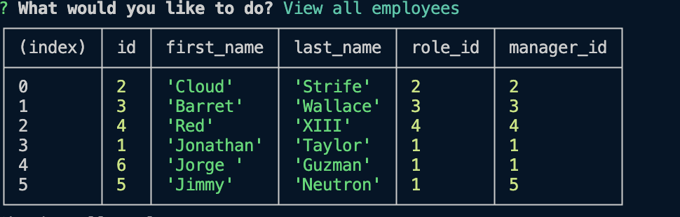

# Employee Tracker

  ## Table of Contents
- [Description](#description) 
- [Installation](#installation)
- [Usage](#usage)
- [Contributing](#contributing)
- [Test](#test)
- [Contact](#contact)
 

  ## Description

  The purpose of this project is to create a command line application showing employee database.
  

 
  
  ## Installation

  <video controls src="Employee Tracker.mp4" title="Title"></video>

  To install, clone Github repository and install on local machine.

  ## Usage

  For usage, node.js, Inquire, pg npm packages, and postgres sql must be installed, 

  ## Contributing
  Jorge Guzman

  ## Test
  Various test were ran using node js.
  
  ## Contact
  Email: jguzman913@gmail.com

  Github: https://github.com/JGuzman87/